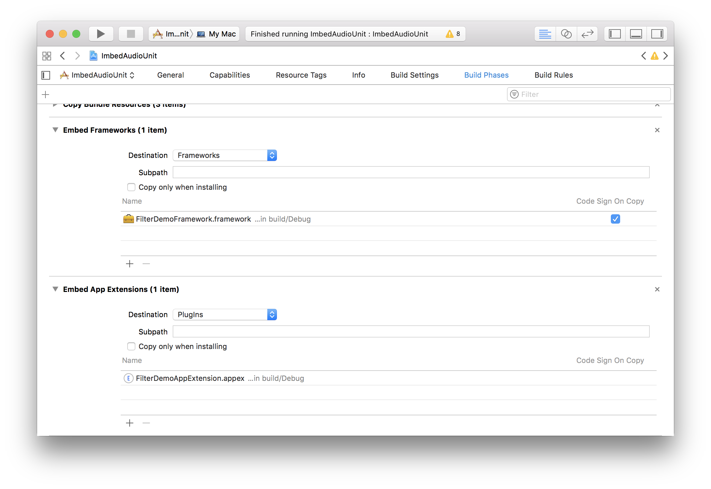
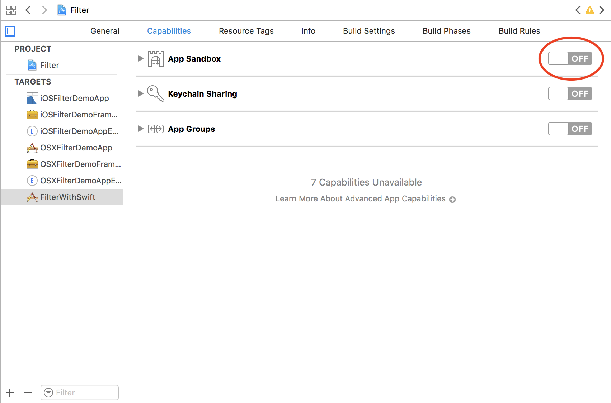

# Embedding an Audio Unit in an Application
Examples of embedding AUV3s in an app

---

## Contents
* [Structure](#structure)
* [Swift-ifying](#swift-ifying)
  * [Mixed Swift and Objective C](#mixedswiftobjc)

---

## Structure

For each example, the structure is the same. For embedding the Audio Unit, a framework target is created that contains that the contents of the main Audio DSP as well as the Nib for the plug-in view. The app extension creates the audio unit factory and registers an audio unit with the given component description, see `FilterDemoViewController+AUAudioUnitFactory.m` line 15.

If recreating you will need to make sure the relevant frameworks have been embedded

Sandbox mode will also need to be disabled in order for the [registered audio unit to actually load](https://github.com/AudioKit/AudioKit/issues/1415).

---

## Swift-ifying

[Apple's AUV3 example code](https://developer.apple.com/library/archive/samplecode/AudioUnitV3Example/Introduction/Intro.html#//apple_ref/doc/uid/TP40016185) is an odd beast that still uses Objective-C for the interface side of the macOS Application examples. If there is one thing I hate more than Javascript, it's Objective-C. I was looking to understand more of how to put an Audio Unit into an application so this seemed like a perfect opportunity to port over the code.

---

### MixedSwiftObjC

This example simply translates over the main app interface but has left the underlying objective-c of the Audio Unit view controller untouched.
To ensure that everything compiles and Swift will see the Objective-C based framework. A bridge header is created in the main app target. If you created a Swift project and try to create a new Objective-C file you should be treated to following dialog. Select "Create Bridging Header"

All that should need to be changed are the FilterDSPFile contents and the Nib to match your parameters.

This is a very stripped back version of the Apple Example in order to de-mystify what is going on. Look at `SimplePlayEngine.swift` and the function `selectAudioUnitWithComponentDescription` for loading the audio unit. Actual loading of Audio unit take place starting line 479.

---
